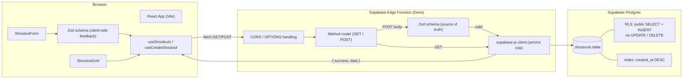

# Architecture & Setup Guide

This document covers system design, local environment setup, and deployment for the Team Shoutout Board.

---

## 1. System Design Overview



### Request flow

1. The React app renders `ShoutoutForm` and `ShoutoutGrid`, both backed by hooks in `src/hooks/`.
2. On submit, `ShoutoutForm` validates against the shared Zod schema (`src/types/shoutout.ts`) for instant feedback, then calls `useCreateShoutout`, which `POST`s JSON to the `shoutouts` Edge Function.
3. The Edge Function re-validates the payload with its own copy of the schema (the actual security boundary — the frontend check is UX only), inserts via the service-role Supabase client, and returns `{ success, data }` or `{ success: false, error }`.
4. `useShoutouts` fetches the list on mount via `GET`, ordered newest-first (enforced both by the query and by the `created_at DESC` index).
5. RLS on the `shoutouts` table independently enforces that only `SELECT` and `INSERT` are possible — even if application code had a bug, the database itself rejects `UPDATE`/`DELETE`.

---

## 2. Local Development Setup

### Prerequisites

| Tool           | Version                                               | Purpose                                                     |
| -------------- | ----------------------------------------------------- | ----------------------------------------------------------- |
| Node.js        | ≥ 20 LTS                                              | Frontend runtime                                            |
| npm            | ≥ 10                                                  | Package manager                                             |
| Docker Desktop | latest                                                | Runs local Supabase stack                                   |
| Supabase CLI   | ≥ 1.190                                               | Local orchestration, migrations, functions, type generation |
| Deno           | ≥ 1.44 (bundled with Supabase CLI's function runtime) | Edge Function local execution/testing                       |

Install the Supabase CLI:

```bash
# macOS
brew install supabase/tap/supabase

# Windows (Scoop)
scoop bucket add supabase https://github.com/supabase/scoop-bucket.git
scoop install supabase

# npm (cross-platform, project-local)
npm install -D supabase
```

### First-Time Boot

```bash
git clone <repo-url> team-shoutout-board
cd team-shoutout-board
npm install
cp .env.example .env.local          # fill in local Supabase URL/keys once `supabase start` prints them

supabase start                      # boots local Postgres, Auth, Storage, Studio, Realtime, Functions runtime
supabase db reset                   # applies supabase/migrations/*.sql to the fresh local DB
```

`supabase start` prints your local API URL, anon key, and service-role key — copy them into `.env.local`. Local Studio (DB browser) is typically at `http://localhost:54323`.

### Running the App Locally

Two processes run side by side:

```bash
# Terminal 1 — Edge Function
supabase functions serve shoutouts --env-file .env.local

# Terminal 2 — Frontend
npm run dev
```

The Vite dev server runs at `http://localhost:5173`; the local Edge Function is reachable at `http://localhost:54321/functions/v1/shoutouts`. The frontend's `VITE_SUPABASE_URL` should point at the local Supabase URL so requests reach the local function, not a deployed one.

### Manual API Verification

```bash
# List shoutouts
curl http://localhost:54321/functions/v1/shoutouts

# Create a shoutout
curl -X POST http://localhost:54321/functions/v1/shoutouts \
  -H "Content-Type: application/json" \
  -d '{"from_name":"Ada","to_name":"Grace","message":"Thanks for the code review!","emoji":"🔥"}'
```

---

## 3. Type Generation Workflow

Frontend types for the `shoutouts` table are generated from the live schema, never hand-written:

```bash
supabase gen types typescript --local > src/types/database.types.ts
```

Run this after every migration change and commit the regenerated file alongside the migration in the same PR. `src/types/shoutout.ts` (the Zod-derived API contract type) is separate from `database.types.ts` (the raw table shape) — the former describes what the API accepts/returns, the latter describes what Postgres stores; they're kept in sync by hand since one is a Zod schema and the other is CLI-generated.

---

## 4. Production Deployment

### Edge Function

```bash
supabase link --project-ref <your-project-ref>
supabase secrets set SUPABASE_SERVICE_ROLE_KEY=<service-role-key>   # if not already set for the project
supabase functions deploy shoutouts
```

The deployed function is reachable at:

```
https://<project-ref>.supabase.co/functions/v1/shoutouts
```

### Database

```bash
supabase db push   # applies any migrations not yet run against the linked remote project
```

### Frontend (static hosting)

The Vite build output (`dist/`) is a static bundle deployable to any static host. Set the following environment variables in the host's dashboard (not committed to the repo):

| Variable                 | Value                               |
| ------------------------ | ----------------------------------- |
| `VITE_SUPABASE_URL`      | `https://<project-ref>.supabase.co` |
| `VITE_SUPABASE_ANON_KEY` | your project's anon/public key      |

**Vercel**

```bash
vercel --prod
```

Build command: `npm run build` · Output directory: `dist`

**Netlify**

```bash
netlify deploy --prod --dir=dist
```

Build command: `npm run build` · Publish directory: `dist`

**GitHub Pages**

```bash
npm run build
npx gh-pages -d dist
```

If deploying under a subpath (`username.github.io/repo-name`), set `base` in `vite.config.ts` to match.

---

## 5. Related Documents

- [`README.md`](../README.md) — project overview, setup, and the techniques used
- [`docs/DESIGN_SYSTEM.md`](./DESIGN_SYSTEM.md) — visual/UX standards
- [`docs/TESTING_GUIDELINES.md`](./TESTING_GUIDELINES.md) — testing strategy
- [`.env.example`](../.env.example) — environment variable reference
